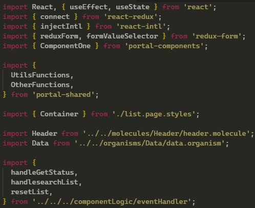
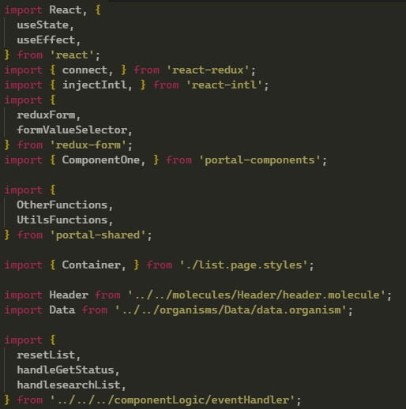

# Santa Importer README

## **Are you sick of consuming bean based beverage while having the ugliest import stack on the planet?** 🙄

## Great! We have just the thing for you, the mighty ***Santa Importer!*** 🎅👌

----------------------

## Features

### Santa Importer is here to cease your intake of caffeine by Xmas-ing your imports! 

## but how? 🤔
 
## **Literally**, this will format your import stack and it will look amazing. 👌

## Before Xmas-*ing* your imports 💀

## After Xmas-*ing* your imports 🤯

## All you gotta do is use the command `>Xmas Imports ASAP` and all your problems related to not so good looking imports will have vanished.

-------------------------------------------------------

# DRINK WATER NOT COFFEE

## Release Notes

implemented code formatting for typescript and javascript files, currently only formats in christmas tree ordering (order by length).

### 1.0.0

Official release of Santa Importer.